# Projeto de ETL

- Para iniciarmos esse projeto, usei a Estrutura abaixo:
- Cloud Functions
- Cloud Storage
- Big Query
  
Usei toda a estrutura do Google Cloud Platform (GCP)

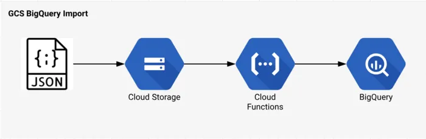

Os dados são extraídos de algumas ferramentas de segurança, pois o objetivo é entender qual a quantidade e os tipos de vulnerabilidades são encontradas nas ferramentas de segurança. Assim, foram utilizadas as ferramentas:
- SCA (WhiteSource)
- SAST (Bandit e Snyk)
- DAST (OWASP ZAP)
Essas ferramentas foram coletas através dos repositórios do Github, Snyk e Gitlab conforme arquivos `project_id_gitlab`,`repository` e `project_id_snyk`

## Cloud Functions

Utilizei as Cloud functions por serem Funções Como Serviço. Assim, o modelo de pagamento é baseado no total de invocações. Com um ambiente de execução serverless e código executado num ambiente gerenciado, onde funções de propósito único são escritas e ativadas por eventos pré definidos emitidos por outros serviços da GCP.

Foram desenvolvidas duas cloud functions.
- A primeira para realizar toda a parte de extração das ferramentas de segurança para armazenar em arquivo json final. Antes disso, todos os arquivos gerados são enviados em formato csv para um bucket temporário. Após isso, são concatenados e é gerado um json com arquivo final desses dados. Para a geraçao desse trigger, pode ser feito através de um request, onde será possível ter esse output:
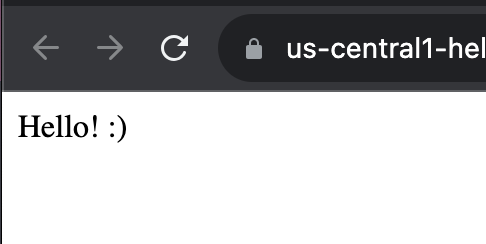

- A segunda function foi usada com um trigger, onde se o arquivo json fosse enviado para o bucket, será adicionada no Cloud Storage.
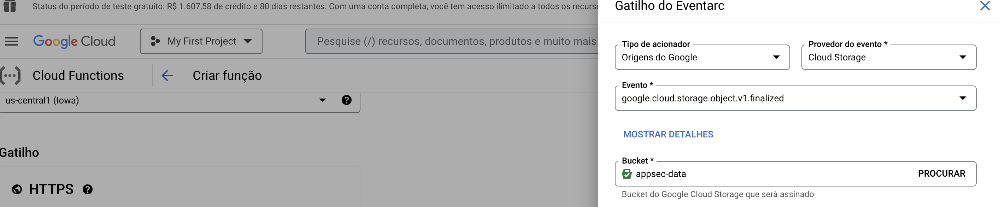

Imagens:

### Functions
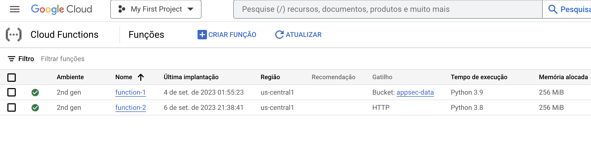

### Extração de dados de segurança
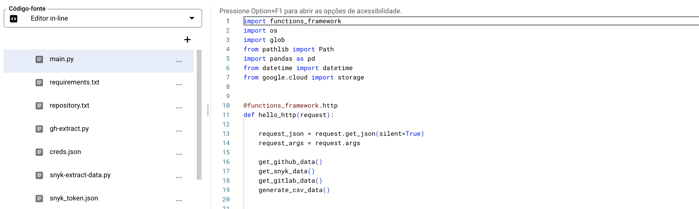

### Bucket temporário
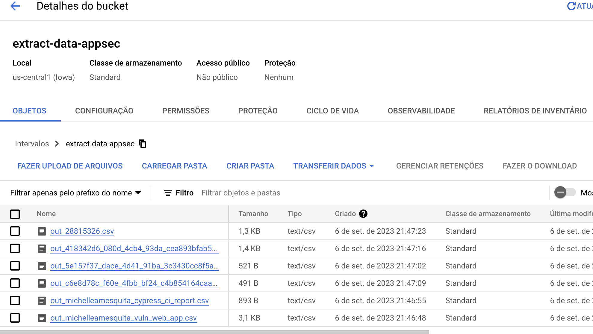

### Upload do json
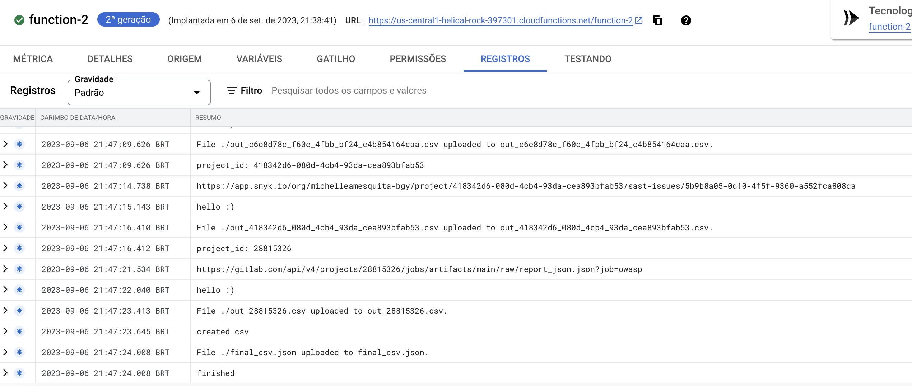

### Carregamento do arquivo json

### Envio do json para Cloud Storage
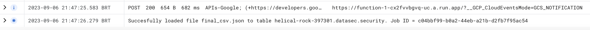

## Cloud Storage

Foi possível observar o upload e os dados armezados no banco de dados do GCP. Para isso, utilizei o arquivo json como modelo para as colunas que são usadas no Cloud Storage.
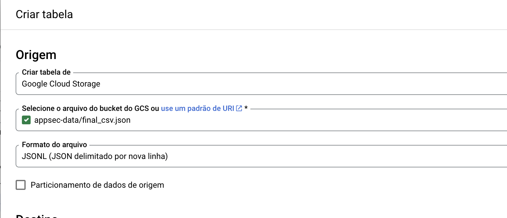

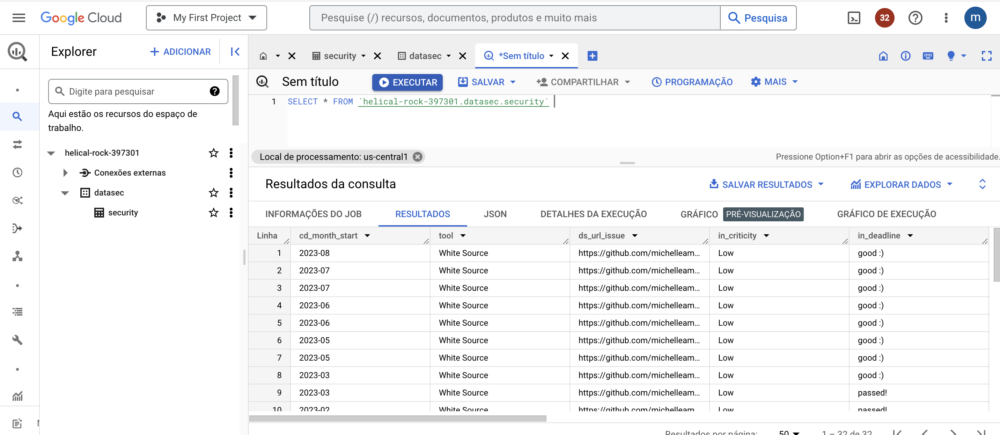

## Análise de dados usando Jupyter-lab
No próprio gcp, foi possível criar uma instância com jupyterlab
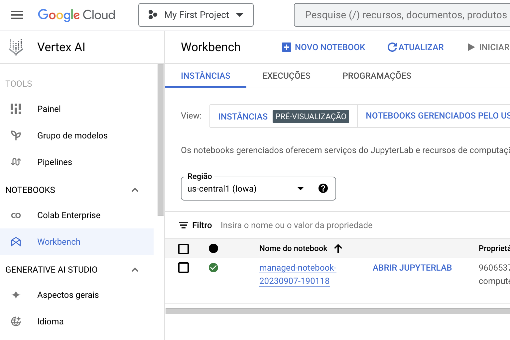

Assim, podemos concluir que a ferramenta SAST obtém mais vulnerabilidades e os principais tipos de vulnerabilidade são: 
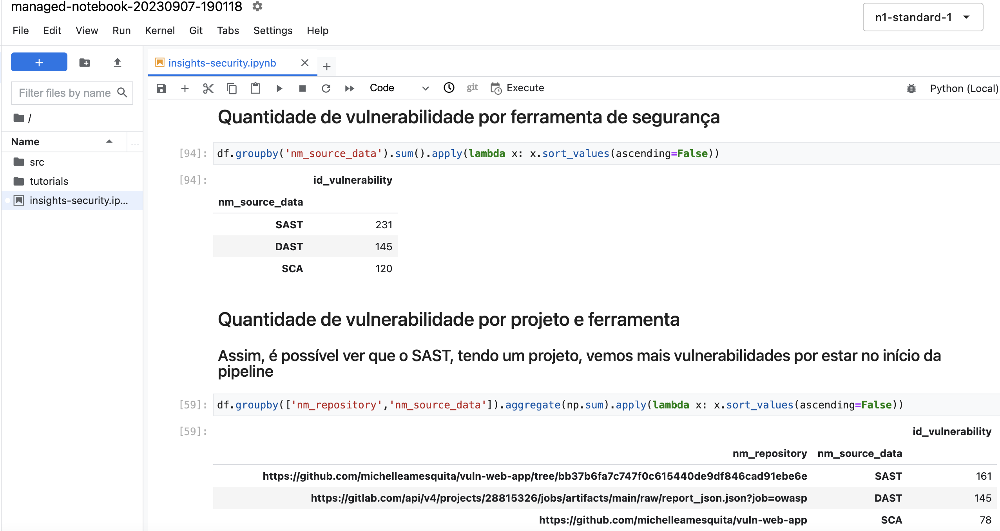

| Vulnerabilidades  | Quantidade   |
| ------- | -------- |
Cross-site Scripting (XSS) |	85
Debug Mode Enabled |	56
Permissions Policy Header Not Set	| 31
Application Error Disclosure |	30
Missing Anti-clickjacking Header |	29

### ➡️ É possível observar todo o resultado dessa análise através do arquivo [`insights-security.ipynb`](https://github.com/michelleamesquita/puc-eng-dados-gcp/blob/main/insights-security.ipynb)

Espero que tenham gostado 👩‍💻
